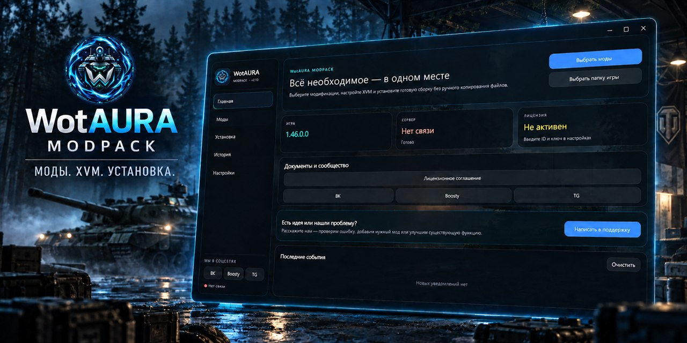

# WotAURA ModPack

Современный установщик модов для игры «Мир танков»: удобный выбор модификаций, автоматическая установка, настройка XVM и защищённый доступ к Premium-возможностям.

## Скачать

**[Скачать WotAURA 2.1.0](https://github.com/lyprot99/WotAURA-ModPack/releases)**

Программа распространяется одним файлом — `WotAURA.exe`.

## Как установить

1. Скачайте `WotAURA.exe` со страницы Releases.
2. Перед запуском установки закройте игру.
3. Запустите WotAURA и укажите папку с игрой.
4. Выберите нужные моды и режим установки.
5. При желании поддержите развитие проекта на Boosty и вступите в закрытое сообщество WotAURA.

Перед изменением игровых файлов установщик сохраняет необходимые данные для восстановления.

Скачивайте WotAURA ModPack только из этого репозитория.

## Поддержка

Сообщить об ошибке или предложить новый мод можно через раздел «Поддержка» в Telegram-боте либо непосредственно в приложении WotAURA.

Текущая версия: **2.1.0**.
